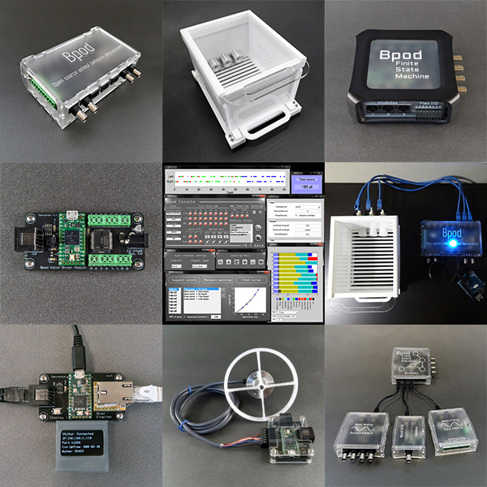

# Bpod MATLAB Software Repository

Bpod is an open source platform for animal behavior measurement and real-time stimulus control. Bpod is actively developed and maintained by [Sanworks LLC](https://sanworks.io/).

## Wiki

Documentation is provided on the [**Bpod Wiki**](https://sanworks.github.io/Bpod_Wiki/).

## Contents ##

This repository includes:
* MATLAB experiment control software for Bpod
* Example settings and calibration files
* Example protocols
* Example module firmware
* A firmware loading tool

## Setup ##

* Add /Bpod_Gen2/ to the MATLAB path
* Connect a Bpod State Machine to your PC
* Run Bpod() at the MATLAB command prompt
* See the wiki (above) for more info

## Contributions ##
* Please note the guidelines given [here](/CONTRIBUTING.md).

## Companion Repositories ##
* [Bpod Firmware](https://sanworks.github.io/Bpod_Wiki/install-and-update/firmware-repo-list/) 
* [Bpod Hardware & CAD](https://github.com/sanworks/Bpod-CAD)
